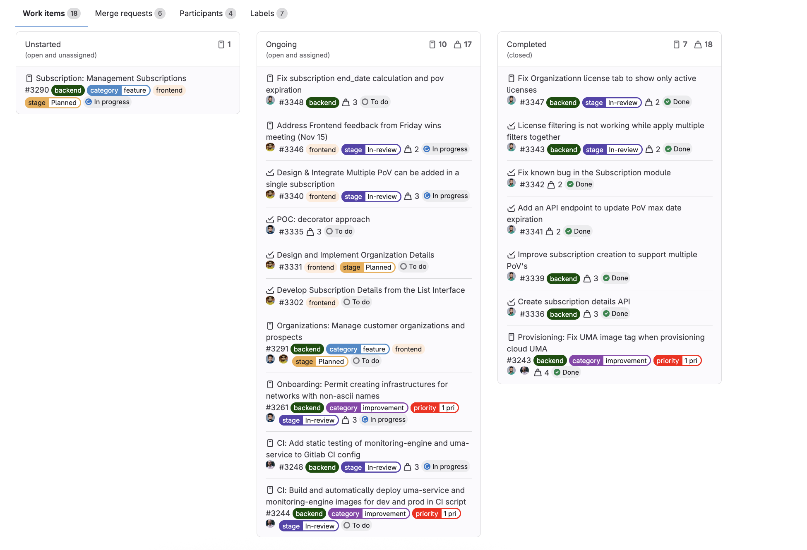

# Gitlab milestone support for subtasks

This extension modifies the Gitlab milestone view to group subtasks with their
respective parent tasks, if found. This makes a milestone which includes both
subtasks and parent tasks more structured and easier to understand.

In addition it highlights in-progress tasks.

## Screenshots

**Before:**

**After:**

## Installation

### Firefox

1. Navigate to `about:debugging#/runtime/this-firefox`
2. Click "Load Temporary Add-on"
3. Select any file

### Chrome

1. Navigate to `chrome://extensions/`
2. Click "Load unpacked"
3. Select the extension folder
